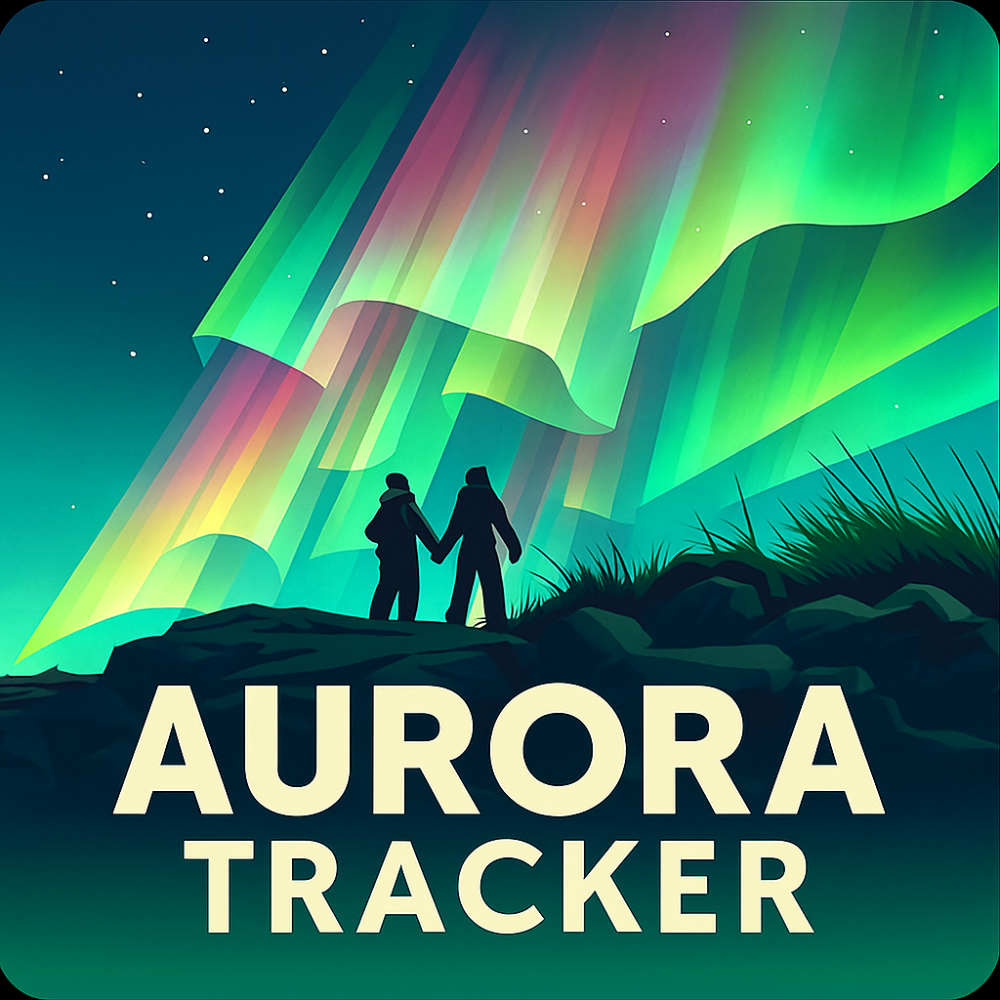
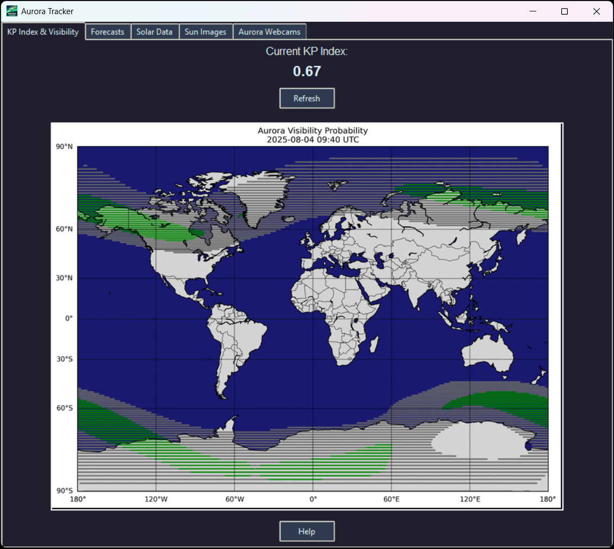
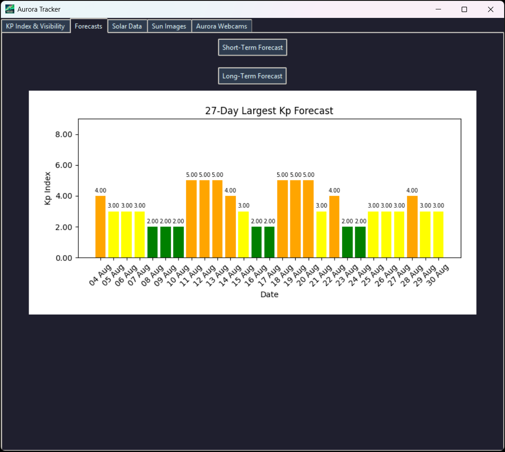
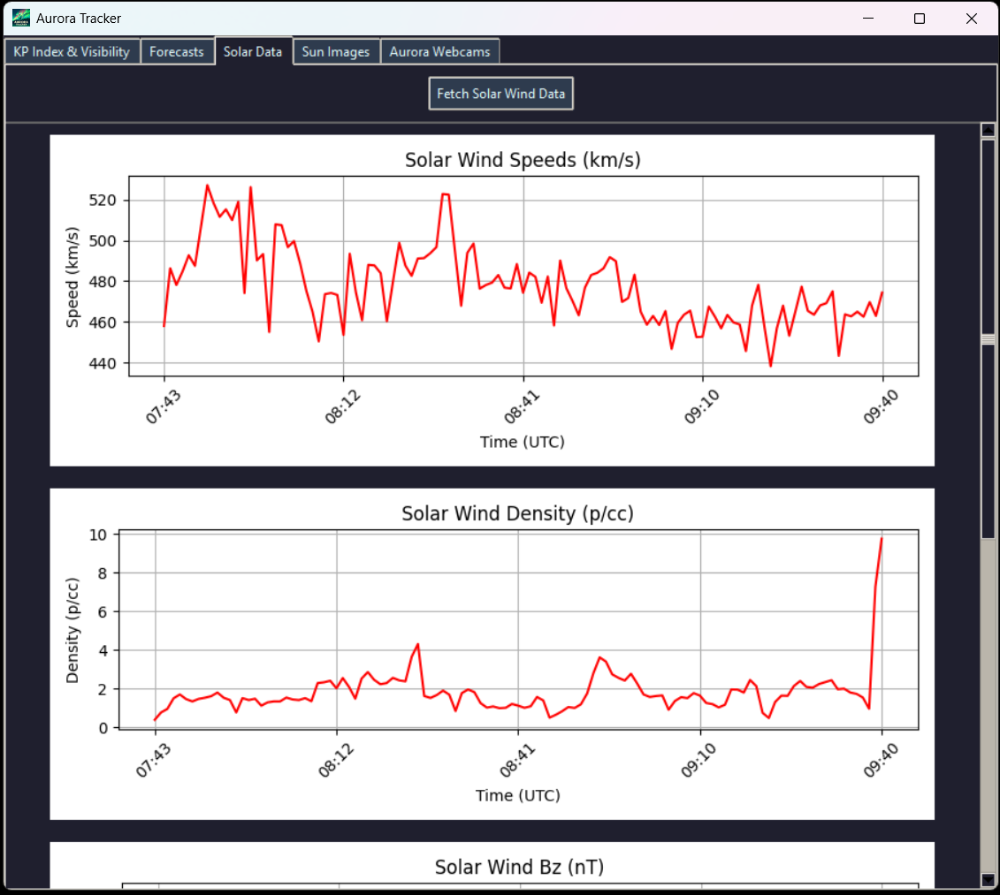
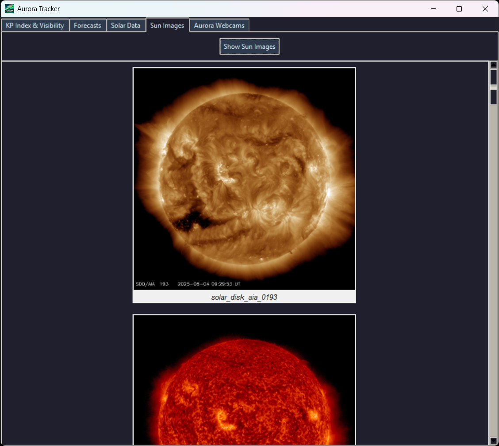
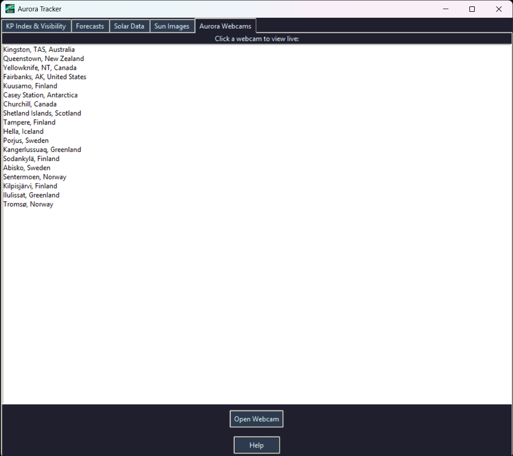

# 🌌 Aurora Tracker


**Aurora Tracker is a Python-based application that visualizes real-time and forecasted aurora activity using NOAA SWPC data, solar wind measurements, and live webcams.**  

It features a Tkinter GUI with multiple tabs for Kp index, aurora maps, solar wind charts, sun imagery, and global webcams.

---

## ✨ Features

📊 **Real-time Kp Index** – Displays current geomagnetic activity.
🗺️ **Aurora Forecast Map Overlay** – Generates global aurora probability maps using NOAA Ovation model.
📅 **Short-term & Long-term Forecasts** – 3-day and 27-day Kp index forecasts plotted as bar charts.
🌬️ **Solar Wind Data** – Live Bz, Bt, speed, and density plots.
🌞 **Sun Images** – Fetches latest SDO sun imagery.
📹 **Aurora Webcams** – Curated list of live streams ranked by visibility.

---

## 📸 Screenshots

| Kp Index & Visibility | Forecasts | Solar Data | Sun Images | Aurora Webcams |
|-----------------------|-----------|------------|------------|----------------|
|  |  |  |  | 

---

## 📁 Project Structure

```
aurora-tracking-tool/
├── src/
│   ├── __init__.py
│   ├── main.py                      # Main entry point for launching the GUI
│   ├── gui.py                       # GUI logic using tkinter
│   ├── aurora/
│   │   ├── __init__.py
│   │   ├── aurora_map_overlay.py    # Aurora probability map generation
│   │   ├── kp_index.py              # Current Kp index retrieval
│   │   ├── forecast.py              # Short and long-term Kp index forecasts
│   │   ├── swpc_map.py              # Get, download, and render SWPC aurora map (not in use)
│   │   ├── solar_data.py            # Fetch solar wind data and sun imagery
│   │   ├── webcams.py               # Fetch and sort links/feeds to live aurora webcams
│   │   ├── location.py              # Geolocation helper logic
│   │   └── viewer_ranker.py         # Rank current best viewing locations (not in use)
│
│   ├── data/
│   │   ├── location_data.json       # Static data about key viewing locations
│   │   └── icons/                   # GUI icons and assets
│
│   ├── utils/
│   │   ├── __init__.py
│   │   ├── api_helpers.py           # Common API request/response parsing
│   │   ├── chart_helpers.py         # Chart coloring & helper functions
│   │   ├── map_helpers.py           # Map projection setup & color mapping
│   │   ├── image_utils.py           # Handle map/satellite image processing
│   │   └── geo_utils.py             # Coordinate and time zone utilities
│
│   └── config.py                    # API keys, constants, and user config
│
├── tests/                           # Unit tests for all modules
│
├── assets/                          # Images/maps downloaded locally
│
├── requirements.txt
├── README.md
└── LICENSE

```

---

## 🚀 Getting Started

### ✅ Prerequisites

- [Python 3.10+](https://www.python.org/downloads/)
- [Astral 3.2+](https://pypi.org/project/astral/)
- [Basemap Toolkit 1.3+](https://pypi.org/project/basemap/)
- [Matplotlib 3.7+](https://pypi.org/project/matplotlib/)
- [NumPy 1.23+](https://pypi.org/project/numpy/)
- [Pillow 10.0+](https://pypi.org/project/Pillow/)
- [Pyproj 2.0+](https://pypi.org/project/pyproj/)
- [Pytz 2023.3+](https://pypi.org/project/pytz/)
- [Requests 2.31+](https://pypi.org/project/requests/)
- [Tkintertables 1.2+](https://pypi.org/project/tkintertable/)

### 📦 Installation

1. Clone the repository:
   ```bash
   git clone https://github.com/ThisIsMikeyS/aurora-tracking-tool.git
   cd aurora-tracking-tool
   ```

2. (Optional) Create a virtual environment:
   ```bash
   python -m venv venv
   venv\Scripts\activate
   ```

3. Install required packages:
   ```bash
   pip install -r requirements.txt
   ```

---

## ▶️ Running the App

To start the GUI:
```bash
python -m src.gui
```

**Note:** Ensure you have internet access for live data (NOAA, NASA, webcams).

---

## 🖥️ Usage
Once started:

- **KP Index & Visibility** – Shows the current Kp index and aurora map overlay.
- **Forecasts** – Displays both short-term and long-term Kp index predictions.
- **Solar Data** – Plots recent solar wind and magnetic field measurements.
- **Sun Images** – Shows NASA SDO imagery with zoom support.
- **Aurora Webcams** – Lists live aurora webcams sorted by visibility.

ℹ️ Tooltips and help dialogs are available in certain sections.

---

## 🧪 Running Tests

Run all tests:
```bash
python -m unittest discover tests
```

Expected output:
```
----------------------------------------------------------------------
Ran 61 tests in X.XXXs

OK
```

---

## 🛠️ Future Improvements

- Cloud coverage integration
- Real-time aurora alerts
- Enhanced webcam ranking algorithm
- Light/dark theme toggle
- Responsive GUI design
- Auroral oval prediction animation
- Additional aurora webcams
- Webcam preview thumbnails
- Exportable reports of aurora activity

---

## 📚 License

Licensed under the MIT License — see [LICENSE](LICENSE) for details.

---

## 🧑‍💻 Author

**Michael Saunders**  
Freelance Software & Systems Developer | Technical Writer  
[LinkedIn](https://www.linkedin.com/in/michael-saunders-805785128/) · [GitHub](https://github.com/ThisIsMikeyS)

---

## 🌐 Acknowledgments

Special thanks to:
- GFZ for Kp index data
- NOAA SWPC for space weather forecast data
- NASA SDO for solar imagery
- IP-API for geolocation services
- Aurora webcam providers for their live streams
